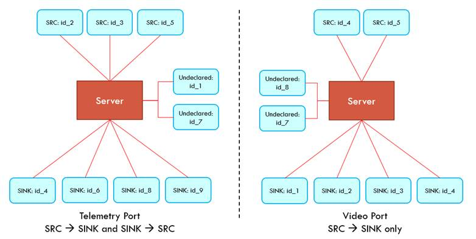

# Avionics F2019
## System Diagrams
### Full System Architecture

### Payload Architecture

### Payload Architecture

## Component Descriptions
- **Teensy**:The Teensy folder contains the Arduino file that allows the co-processor to go through the initiation and calibration procedure and to  sample data from the sensor suite, serializing this data via a JSON packet to be sent to the Pi for distribution. ## **(Tyler* is a wanker)**
- **Raspi**: WRITE DESCRIPTION
- **Nav**: The navigation capability keeps us updated on where the vehicle is, its velocity, and its attitude. It incorporates data from all the sensors on board to come up with an estimated state, then does some light filtering to smooth out the data before it gets transmitted to the ground.
- **Ground_station**: WRITE DESCRIPTION
- **Simulation**: WRITE DESCRIPTION
- **Packetizer**: WRITE DESCRIPTION

## Payload Setup and Dependencies
### Set Up Conda Environment
1. Install anaconda: https://www.anaconda.com/distribution/
    - Be sure to download the Python 3 version
2. From the command line, run: `conda create env -f condaenv.yml`
3. Activate the conda environment: `conda activate avionics`

## Ground Station Setup and Dependencies
